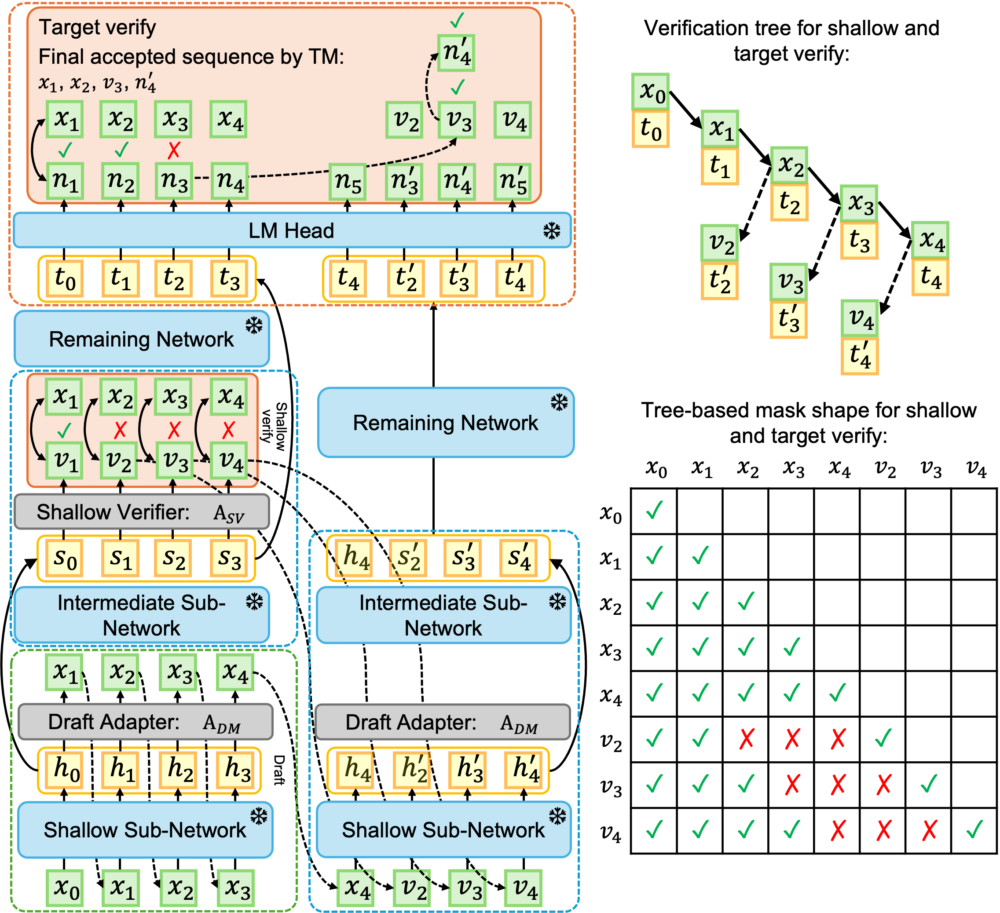
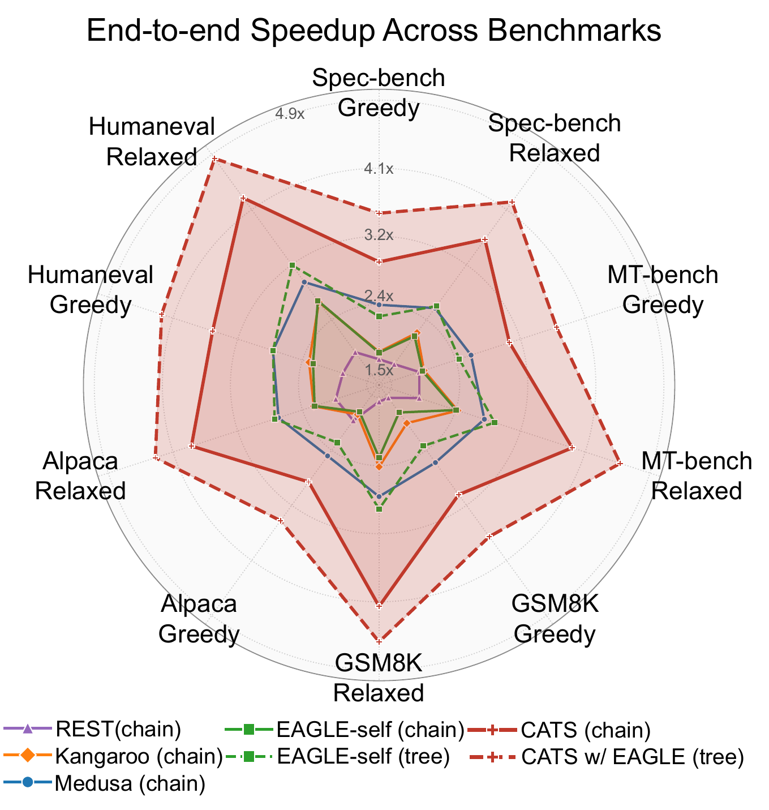

<div align="center">

# CATS: Cascaded Adaptive Tree Speculation for Memory-Limited LLM Inference Acceleration

[](https://arxiv.org/abs/2605.11186)
[](LICENSE)

</div>

Official implementation of **CATS** — a cascaded, adaptive tree-based speculative decoding scheme designed for memory-limited LLM inference. A small *draft adapter* attached to an early exit of the base LLM proposes a dynamic tree of candidate tokens; a *shallow adapter* at a deeper exit performs cheap verification; tokens that survive are confirmed by the full target model. The cascade preserves the target distribution while reducing target-model forward passes.

This repository contains the model definitions, training pipeline (data generation + adapter fine-tuning), and the evaluation entry point used in the paper.

## Overview

**CATS** is a self-speculative decoding framework for accelerating LLM inference on memory-limited devices. It performs cascaded verification and correction guided by the device's memory budget and parameter offloading patterns, maximizing token acceptance rate and end-to-end speedup while keeping the peak memory footprint equal to that of the target model alone — without the auxiliary draft model that existing speculative decoding methods assume HBM can hold.

<div align="center">

</div>

Evaluated on multiple models across five benchmarks on real edge devices, CATS achieves a wall-clock speedup of up to **5.08×** with no degradation in generation quality, outperforming the SOTA method by up to **1.45×** under edge memory constraints.

<div align="center">

<br/>
<em>Radar chart of results on Vicuna-7B across the five benchmarks.</em>
</div>

## Requirements

Tested versions (see `requirements.txt`):

```
torch==2.0.1
transformers==4.33.3
accelerate==0.21.0
fschat==0.2.34
openai==0.28.0
sentencepiece==0.1.99
```

Install:

```bash
pip install -r requirements.txt
```

The training pipeline additionally uses `safetensors`, `datasets`, `tensorboard`, and `matplotlib`.

## Models

CATS uses one base LLM and two adapter checkpoints:

- **Base model** — any LlamaForCausalLM-style checkpoint (e.g. `lmsys/vicuna-7b-v1.3`).
- **Draft adapter** — small 1-layer Llama block attached at an early layer (default `--draft-layer 3`).
- **Shallow adapter** — second 1-layer block attached at a deeper exit (default `--shallow-layer 10/15`).

Each adapter directory must contain a `config.json` (use [data/vicuna_7B_config.json](data/vicuna_7B_config.json) or [data/vicuna_13B_config.json](data/vicuna_13B_config.json) as templates) and a `pytorch_model.bin`. See [cats/cats_model.py](cats/cats_model.py).

## Training

Training has two stages. Both stages contain hardcoded path placeholders (`your_path/...`) and a cluster `MASTER_ADDR`/`MASTER_PORT`; replace these before running.

### 1. Generate training data

[training/ge_data.py](training/ge_data.py) reads the ShareGPT dataset (`ShareGPT_V4.3_unfiltered_cleaned_split.json`), tokenizes conversations with the Vicuna chat template, runs the base model in fp16, and saves per-sample tensors (`input_ids`, `loss_mask`, hidden states from the early exit layer, the layer after, and the final layer) as `.ckpt` files.

```bash
cd training
CUDA_VISIBLE_DEVICES=0 python ge_data.py \
  --start=0 --end=68000 --index=0 --gpu_index 0 \
  --outdir your_path/sharegpt_0_67999_mufp16_layer3
```

Note: the dataset path is hardcoded inside `build_dataset_rank` (`data_path = "your_path/ShareGPT_V4.3_unfiltered_cleaned_split.json"`); edit it to point at your local copy.

### 2. Fine-tune the adapter

[training/fine_tune_adapter.py](training/fine_tune_adapter.py) is a driver that launches [training/train_finetune.py](training/train_finetune.py) once per epoch via `accelerate launch --multi_gpu` (configured for 2 GPUs by default).

```bash
cd training
python fine_tune_adapter.py \
  --exit_layer 15 \
  --topk 20 \
  --start_epoch 0 --end_epoch 20 \
  --data_home your_path/sharegpt_0_67999_mufp16_layer15
```

(`fine_tune_adapter.py` does `os.chdir(os.path.dirname(__file__))` on launch, so it must be invoked from the `training/` directory — or with an absolute path — for the relative `--configpath ./data/vicuna_7B_config.json` to resolve correctly.)

Train the **draft** and **shallow** adapters separately using different `--exit_layer` values (e.g. 3 and 10/15).

## Evaluation

The evaluation entry point is [evaluation/CATS_dynamic.py](evaluation/CATS_dynamic.py). It loads the base model with `EarlyExitLlamaForCausalLM`, attaches both adapters via `MultiAdapterCATSModel`, and runs dynamic-tree speculative decoding on a chosen benchmark.

### Question files

The script reads from `data/question_mtbench.jsonl` (hardcoded at [evaluation/CATS_dynamic.py:1829](evaluation/CATS_dynamic.py#L1829)). The provided benchmarks live in [data/test_benches/](data/test_benches/) — either edit that line, or copy/symlink the file you want to `data/question_mtbench.jsonl` before running.

Available benchmarks: `mtbench`, `alpacaeval`, `gsm8k`, `humaneval`, `spec`.

### Chain vs. tree mode

The same script supports both chain-style and tree-style speculation:

| Mode | `--tree-topk` | `--total-tokens` |
|---|---|---|
| Chain | `1` | `-1` |
| Tree  | `10` (typical) | `40` (typical) |

`--total-tokens -1` auto-sizes the budget to `steps * tree_topk + 1`.

### Run

```bash
CUDA_VISIBLE_DEVICES=0 PYTHONPATH="$PWD" python3 evaluation/CATS_dynamic.py \
  --model-path        "$MODEL_PATH" \
  --draft-adapter-path "$DRAFT_ADAPTER_PATH" \
  --shallow-adapter-path "$SHALLOW_ADAPTER_PATH" \
  --model-id          cats_chain_mtbench \
  --bench-name        mt_bench \
  --question-begin 0 --question-end 80 \
  --draft-layer 3 --shallow-layer 15 \
  --steps 5 --sv-passes 1 \
  --threshold 0.0 \
  --tree-topk 1 --total-tokens -1 \
  --num-runs 1 \
  --temperature 0.0 --typical-tau 0.0 --typical-alpha 0.0 \
  --dtype float16 \
  --max-new-tokens 1024
```

See the full argument list at the bottom of [evaluation/CATS_dynamic.py](evaluation/CATS_dynamic.py).

### Outputs

For each run the script writes:

```
data/<bench-name>/<model-id>/<run_index>.jsonl     # per-question generated answers + timing
data/<bench-name>/<model-id>/verification_metrics.json   # aggregated SV / acceptance metrics
```

The metrics JSON includes mean accepted tokens per step, mean SV-accepted tokens per step, and shallow-verifier confusion-matrix statistics (TP/TN/FP/FN, precision/recall/F1) across all runs.

## Code Pointers

- `EarlyExitLlamaForCausalLM.forward_draft_or_large_model` ([cats/earlyexit.py](cats/earlyexit.py)) — single forward routine reused for draft, shallow, and target passes. Supports chunked execution over arbitrary `[start_layer, end_layer)` ranges with shared `past_key_values`.
- `AdapterModel` ([cats/adapter.py](cats/adapter.py)) — a 1-layer Llama decoder block plus optional residual/norm; loaded from each adapter directory's `config.json` + `pytorch_model.bin`.
- `MultiAdapterCATSModel` ([evaluation/CATS_dynamic.py](evaluation/CATS_dynamic.py)) — loads the base model once and binds both draft and shallow adapters; `cats_forward_hybrid_evaluation` is the per-question decoding loop registered with `run_eval`.

## Citation

If you find this project useful, please cite:

```bibtex
@article{cats2026han,
  title  = {CATS: Cascaded Adaptive Tree Speculation for Memory-Limited LLM Inference Acceleration},
  author = {Han, Yuning and Jin, Yangchenchen and Zhao, Dylan and Sun, Jingwei},
  year   = {2026},
  journal= {arXiv preprint arXiv:2605.11186},
}
```

## Acknowledgements

This code is based on [Kangaroo](https://github.com/Equationliu/Kangaroo). We thank the authors for releasing their implementation.
